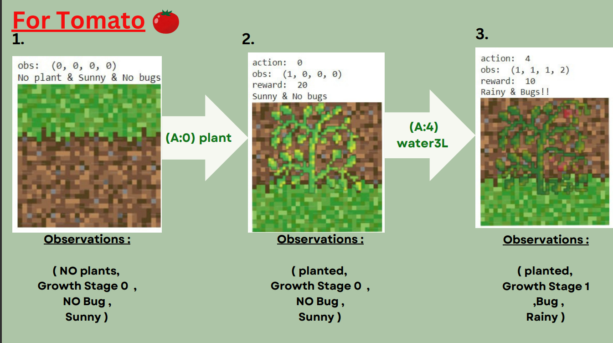
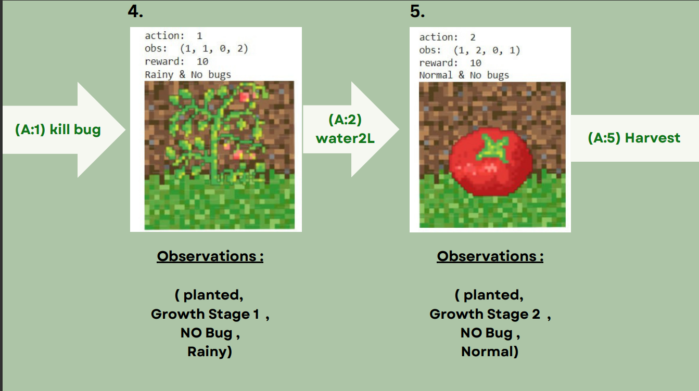
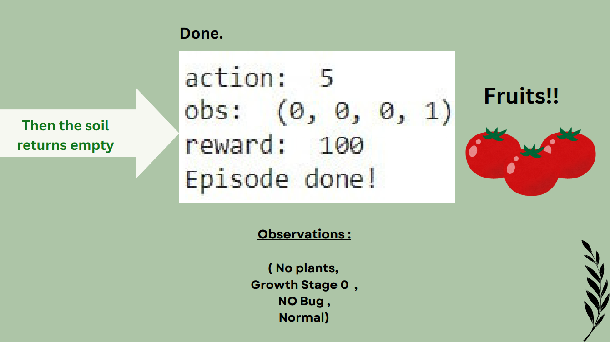
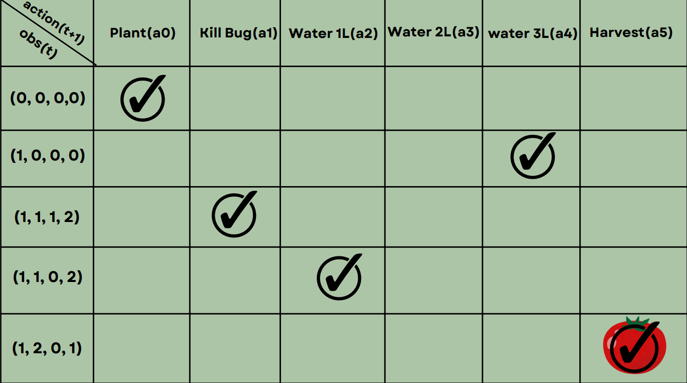
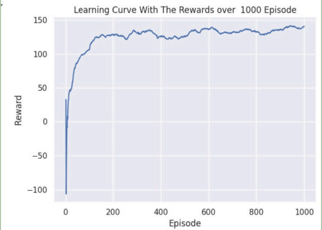

# Farmer Assistant

## Project Description

The "Farmer Assistant" project aims to develop an intelligent agent using the Proximal Policy Optimization (PPO) algorithm. This agent assists farmers in real-time crop management, monitoring growth stages, watering, and pest control to optimize yield and plant health, thereby enhancing agricultural efficiency and productivity.

## Problem Definition

### 1. Description

The project focuses on creating an agent capable of optimizing plant growth and health through various actions, including planting, watering, and pest management amidst fluctuating weather conditions. The agent operates in a simulated environment designed to represent a field with three different plants.

### 2. Environment

The environment simulates three different plant growth scenarios in a single plot field. The agent optimizes plant growth and health through planting, watering, and pest management amidst fluctuating weather conditions. This environment provides a platform for experimenting with agricultural strategies to maximize yield and resilience.

### 3. States

The agent observes the following states:

- **Soil Condition:** Indicates whether the soil is empty (0) or planted (1).
- **Plant Stage:** Represents the growth stage of the plant, ranging from small (0) to fully grown (varies according to plant type).
- **Presence of Bugs:** Indicates the presence (1) or absence (0) of pests.
- **Weather Condition:** Categorized as sunny (0), normal (1), or rainy (2).

#### Plant Stages by Type:
- **Tomatoes:** 0 to 2
- **Corn:** 0 to 3
- **Beans (default):** 0 to 4

Each plant type has multiple states based on its growth stage and weather conditions, resulting in:
- **Tomato States:** 19
- **Corn States:** 25
- **Bean States:** 31

### 4. Actions

The agent can perform the following actions:
- **Plant:** Planting in empty soil.
- **Kill Bug:** Eliminating pests from the plant.
- **Water 1L:** Watering the plant with 1L of water.
- **Water 2L:** Watering the plant with 2L of water.
- **Water 3L:** Watering the plant with 3L of water.
- **Harvest:** Collecting the fully grown plant.

### 5. Rewards

- **Planting:**
  - Reward: +20 for successful planting.
  - Penalty: 0 for attempting to plant in non-empty soil.
  
- **Killing Bug:**
  - Reward: +10 for successfully eliminating pests.
  - Penalty: 0 for attempting to kill non-existent bugs.
  
- **Watering:**
  - **1L:**
    - Reward: +10 if it is rainy.
    - Penalty: -3 if it is sunny or normal, -1 for watering a bad plant, unplanted soil, or fully grown plant.
  - **2L:**
    - Reward: +10 if it is normal.
    - Penalty: -3 if it is sunny, -1 if it is rainy or for watering a bad plant, unplanted soil, or fully grown plant.
  - **3L:**
    - Reward: +10 if it is sunny.
    - Penalty: -3 if it is rainy or normal, -1 for watering a bad plant, unplanted soil, or fully grown plant.

- **Harvesting:**
  - Reward: +100 for harvesting a fully grown plant.
  - Penalty: -10 for harvesting a fully grown plant infested with pests, 0 for attempting to harvest before the plant is fully grown.

### 6. Policy

The agent follows a policy of first planting, then watering appropriately based on the weather, killing bugs if present, and finally harvesting when the plant is ready.

Now we will look at an example of tomato policy

*Note: tomato age is 2 that means it will harvest after 3 times of watering*

## The PPO Algorithm

The Proximal Policy Optimization (PPO) algorithm is used to train an actor-critic model. This policy optimizes the actor's policy using a clipped surrogate objective to improve stability and performance in reinforcement learning tasks. The actor network chooses actions from our action set (plant, kill pests, water 1L, 2L, 3L, and harvest), while the critic network estimates the value function to guide the learning process. The training iterates to maximize rewards while ensuring controlled policy updates through the PPO clipping mechanism.

### Input and Output

- **Input:** Observations of the environment, including soil condition, plant stage, presence of bugs, and weather condition.
- **Output:** 
  - **Policy Logits:** Probability distribution over possible actions given the current state.
  - **Value Function:** Estimate of the expected return or future rewards associated with being in the current state.

### Learning Process

During training, the PPO algorithm aims to improve both the policy and value function by iteratively updating the neural network parameters based on the observed rewards and advantage estimates (GAEs). This process involves maximizing the likelihood of actions with higher rewards (policy optimization) while minimizing the difference between predicted and observed returns (value function optimization).

### Learning Curve

A learning curve is plotted at the end of the code to visualize the agent's performance (reward) over the training episodes.

